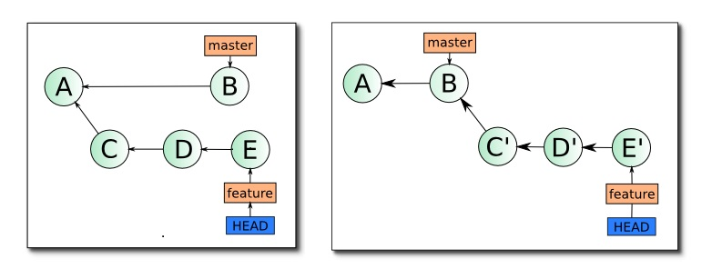

# HomeworkThird
Дополнила проект описанием двух команд.

## Git Cherry Pick
**git cherry-pick** — это полезная команда, с помощью которой можно выборочно применить коммиты Git к текущей рабочей ветке HEAD. С ее помощью можно выбрать коммит из одной ветки и применить его к другой. Команда *git cherry-pick* — это удобный способ отменить изменения. Например, если коммит попал в ветку по ошибке, вы можете переключиться на нужную ветку и выполнить перенос.

## Git Rebase
**Rebase** — один из двух способов объединить изменения, сделанные в одной ветке, с другой веткой, с сохранением всех коммитов.

